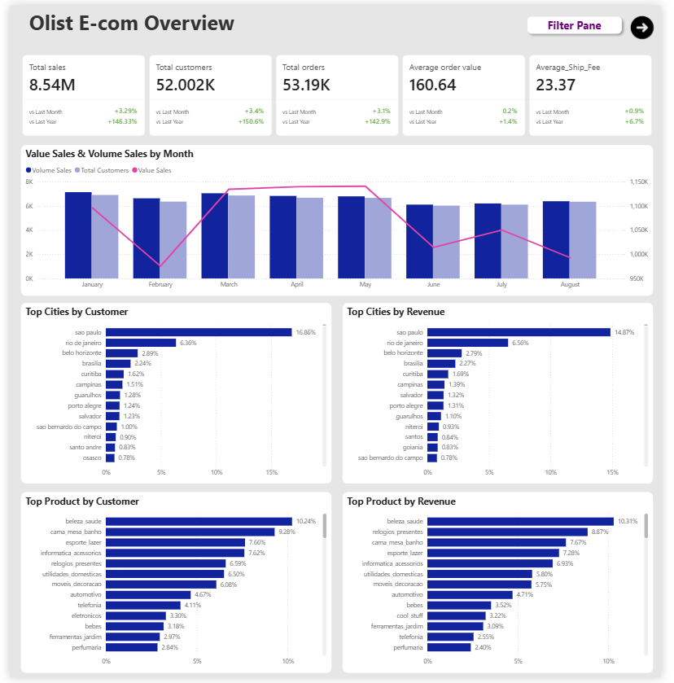
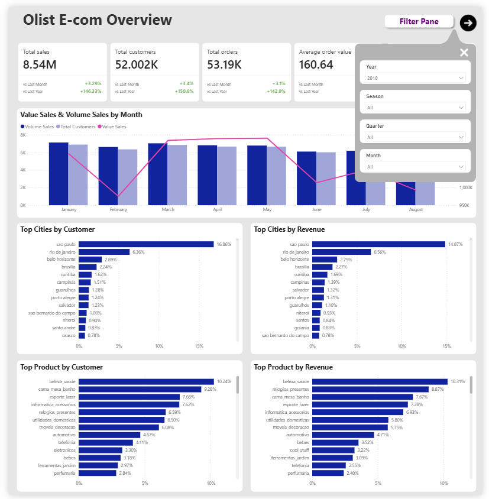

# Olist E-Commerce Data Warehouse & Customer Segmentation Analysis

This project focuses on building an optimized Data Warehouse using a **Star Schema** architecture and implementing **Customer Segmentation** via the **K-Means Clustering** algorithm. Using the Olist (Brazil) e-commerce dataset, this project addresses critical real-world data quality and engineering challenges, including the **Fan-out Effect**, **Data Consistency (Revenue Alignment)**, and **Customer Profile Entity Management** over time.

---

## 📌 Core Features & Data Engineering Methodology

### 1. Resolving the Fan-out Effect (Data Duplication)
* **The Challenge:** In the raw Olist dataset, an order (`order_id`) exhibits a Many-to-Many relationship when cross-joined between order items (products) and payment installments. A direct `JOIN` duplicates records across both tables, exponentially inflating metrics like total revenue upon aggregation (`SUM`).
* **The Solution:** Developed intermediate aggregated CTEs/Views in SQL to independently consolidate product metrics and payment values by `order_id` *before* joining them into the primary Fact table (`fact_orders`). This guarantees a strict **1 row per order** grain in the core sales table.

### 2. Achieving Absolute Data Consistency
* **The Challenge:** During data cleansing, business logic was applied to exclude flawed records (e.g., orders marked as `delivered` or `shipped` but missing actual delivery timestamps) and restrict temporal scope (keeping only records from `2017` onwards). If these filters aren't propagated to the independent payments dataset, it causes a mismatch in financial numbers on the final dashboard.
* **The Solution:** Leveraged the `WHERE EXISTS` semi-join clause in SQL to construct a clean payments view (`v_payments_clean`). Only transaction records belonging to valid, pre-cleansed orders in `fact_orders` are retained, ensuring that the total revenue matches perfectly across all reporting tables down to the last cent.

### 3. Standardizing Customer Entity Profiles (Eliminating Count Discrepancies)
* **The Challenge:** A unique customer (`customer_unique_id`) can purchase items over time and ship them to different addresses. A generic `GROUP BY` on customer IDs and geography splits a single customer into multiple rows across different cities, leading to a structural flaw where `COUNT(customer_unique_id)` exceeds `COUNT(DISTINCT customer_unique_id)`.
* **The Solution:** Implemented a window function `ROW_NUMBER() OVER (PARTITION BY customer_unique_id ORDER BY order_purchase_timestamp DESC)` to isolate the customer’s **most recent** transaction. This dedupes the geography mapping, ensures a strict **1 row per unique customer** contract in `fact_customer_profile`, and captures their latest location for precise geographic analysis.

---

## 🗂️ Data Warehouse Architecture (Star Schema)

The data model is engineered following Star Schema best practices to optimize Power BI DAX performance and relationship handling:

* **Fact Tables:**
  * `fact_orders`: Captures high-level order metadata, status, and total financials (1 row per order). *Primary Key:* `order_id`.
  * `fact_customer_profile`: Consolidates unique customer profiles alongside computed RFM metrics. *Primary Key:* `customer_unique_id`.
* **Dimension Tables:**
  * `v_payments_clean`: Contains granular transaction types (`payment_type`, `payment_installments`). Connects to `fact_orders` via a `1 to Many (*)` relationship.
  * `olist_customers_dataset`: The original standardized customer metadata source.
  * `dim_date`: A dynamic calendar table generated in Power BI, connecting to the customer's `last_purchase_date` to unlock time-intelligence analytics.

---

## 🤖 Machine Learning Customer Segmentation (RFM)

The RFM (Recency, Frequency, Monetary) segmentation is embedded directly into the Power Query ETL pipeline using an integrated **Python** script:

1. **Feature Scaling:** Applied `StandardScaler` to normalize `Recency` (days), `Frequency` (orders count), and `Monetary` (monetary value). This neutralizes scaling bias caused by the vast magnitude differences between financial sums and order frequencies.
2. **K-Means Clustering:** Executed the K-Means algorithm with `n_clusters=4` and a deterministic seed (`random_state=42`) to guarantee reproducible cluster assignments upon dashboard data refreshes.
3. **Business Logic Mapping (DAX):** Translated algorithmic cluster outputs ($0, 1, 2, 3$) into actionable corporate business personas based on behavioral statistical distributions:
   * **Active / New Customers:** Recently engaged shoppers with low Recency metrics.
   * **Loyal Customers:** Frequent buyers with steady order frequencies.
   * **High-Spenders (Whales):** High-net-worth accounts generating substantial monetary volume.
   * **Hibernating / Cold:** At-risk accounts with high Recency metrics who haven't interacted with the platform in months.

---

## 🛠️ Deployment & Installation Guide

### Step 1: Initialize Database Views on SQL Server
Execute the `CreateView-PBI-fact_orders.sql` script inside SQL Server Management Studio (SSMS) to instantiate the optimized data tier.

### Step 2: Inject the Clustering Script in Power BI
1. Open the `Olist Ecom Report.pbix` file using Power BI Desktop.
2. Navigate to **Transform Data** (Power Query) -> Select the `fact_customer_profile` query.
3. Go to the **Transform** ribbon -> Click **Run Python Script**, and paste the K-Means preprocessing and training code.
4. Convert the `last_purchase_date` column data type explicitly back to **Date**.

### Step 3: Verify Model Relationships
Ensure the schema configurations in the **Model View** tab map as follows:
* `fact_orders` (`order_id`) $\rightarrow$ `v_payments_clean` (`order_id`): **1 to Many (*), Cross filter direction: Single**.
* `dim_date` (`Date`) $\rightarrow$ `fact_customer_profile` (`last_purchase_date`): **1 to Many (*), Cross filter direction: Single**.

---

## 📊 Business Insights & Deep Dives

### 📈 Insight 1: Growth Macro Trends & The Feb 2018 Revenue Anomaly
* **Macro Trends (2017 - 2018):** Throughout 2017, Olist experienced healthy, linear growth where Revenue, Sales Volume, and Customer Acquisition expanded in perfect correlation. However, 2018 marked a plateau phase; both customer volume and order counts flattened out across months, showing a slight contraction toward the end of the year.
* **The February 2018 Anomaly:** The data highlights February 2018 as the lowest revenue point in the entire timeline. Paradoxically, **Total Orders and Total Customers did not drop**—in fact, transaction volumes remained neck-and-neck with peak months (April, May) and noticeably higher than later periods (June, July, August).

> 🔍 **Granular Verification via Customer Segmentation:**
> Cross-referencing this with our K-Means segments disproves the "customer churn" hypothesis. Evidence shows that **Loyal Customers** remained highly active, still pushing nearly 506 orders in February.

> The revenue crash was entirely driven by a **severe drop in Average Order Value (AOV), skyrocketing down below $150**. Customers were buying at their usual frequency, but they were checking out extremely low-value baskets.

#### 📌 Actionable Business Hypotheses to Validate:
1. **Post-Holiday Deep Discounting / Clear-Out Campaigns:** This anomaly could be the byproduct of aggressive post-New Year clearance sales or high-value voucher injections, which sustained order volumes but thinned out net revenue per invoice.
2. **Product Mix Shift:** A temporary structural shift where consumer demand migrated toward low-tier, fast-moving consumer goods (FMCG) rather than premium high-margin items or bulk bundles.

---

### 🚚 Insight 2: The Shipping Cost Paradox in High-Value Segments
An analysis of segment-specific logistics metrics revealed a critical operational friction point:

* **Logistics Friction for High-Spenders & Loyal Customers:** While **High-Spenders** generate massive basket sizes, they are penalized with **disproportionately high shipping fees (Freight Value)**. A similar high-freight pattern is observed among **Loyal Customers**. This excessive shipping friction serves as the primary psychological barrier restricting their purchase frequency.
* **The Volume-Driven Segments:** Conversely, the remaining two lower-tier segments enjoy minimal shipping friction, which allows them to generate the vast majority of Olist's total aggregate revenue through sheer order volume.

💡 **Strategic Recommendation:** Olist should audit its logistics network and pilot **targeted freight subsidies** or **threshold-based free shipping tiers** specifically engineered for High-Spenders and Loyal Customers to unlock higher purchase frequencies.

